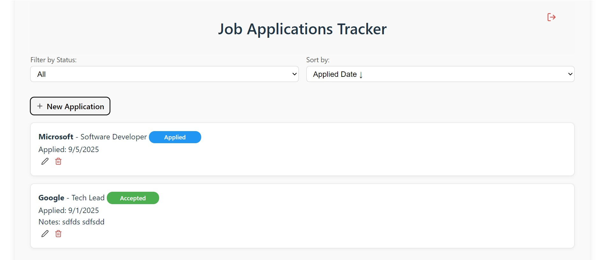
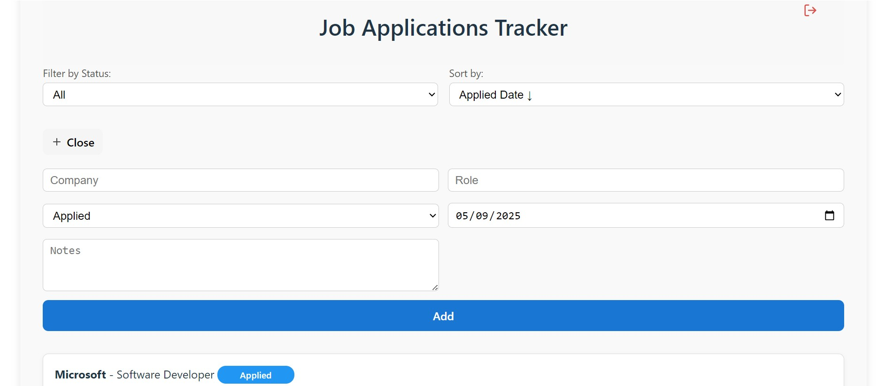

# Job Application Tracker

A web app built with and React to help you keep track of your job applications, ran on [the backend](https://github.com/noahg9/job-tracker-backend) built with .NET.

---

## Screenshots


 |

---

## Tech Stack

- **Frontend:** React + TypeScript + SCSS

---

## Getting Started

### Prerequisites

- [Node.js & npm](https://nodejs.org/)

### Local Setup

1. Clone the repo
2. Run frontend:
   ```bash
   npm install
   npm run build
   ```
